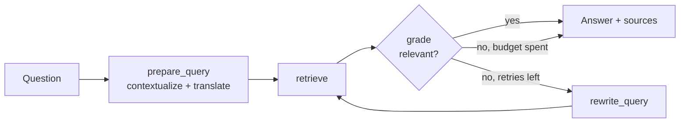

# 📈 Modern SOTA Futures Trading RAG

A production-ready Retrieval-Augmented Generation (RAG) system built with **`uv`**, **LangChain**, **BAAI/bge-small-en-v1.5 Embeddings**, **ChromaDB**, and **Google Gemini 3.5 Flash Lite**.

---

## 🛠️ Tech Stack & Key Features

- **Package & Environment Manager:** `uv` (Fastest Python tooling)
- **Embeddings:** `BAAI/bge-small-en-v1.5` with Maximum Marginal Relevance (MMR) search
- **Vector Search:** ChromaDB
- **LLM:** Pluggable - hosted **Google Gemini** *or* a **local Ollama** model (e.g. Qwen) with no code changes
- **Credential Management:** OS-native keyring (`keyring`) - no plain text `.env` files required
- **Multi-Format Ingestion:** Auto-loads `.pdf`, `.txt`, and `.md` files from `./data`
- **Cloud Document Storage (AWS S3):** Optional S3 cloud integration for storing, streaming, and managing documents dynamically alongside local storage.
- **Smart Data Auto-Sync:** Automated change detection via `.data_manifest.json` fingerprinting
- **LangGraph Orchestration:** The retrieval stage runs as a compiled LangGraph state machine with conditional routing and a bounded self-correction loop
- **Cross-Lingual Retrieval:** Every question is rewritten into the corpus language (using canonical domain terminology) before searching, so a Hungarian question still matches English documents (and vice-versa)
- **Self-Correction & Quality Loop:** Retrieved documents are graded for relevance; if they are irrelevant the query is rewritten and retried (up to `RAG_MAX_RETRIEVAL_RETRIES`, default 3)
- **Answer Groundedness Check (Self-RAG / CRAG):** Generated answers are verified against the retrieved context; ungrounded answers are labelled and stripped of (false) local citations
- **Multi-Query Fan-Out + Rerank (optional):** Expands each query into several variants, retrieves them in parallel and fuses the results with Reciprocal Rank Fusion for broader recall (`RAG_ENABLE_MULTI_QUERY`)
- **Profiles / Multi-Tenant Routing (optional):** Serve several businesses from one app — each profile has its own system prompt, and questions can be auto-routed to the best-matching profile (`RAG_ENABLE_PROFILE_ROUTING`)
- **Live Pipeline Progress:** The web UI streams each retrieval stage (routing → preparing → retrieving → grading → answering) so users see what the assistant is doing
- **Durable, Resumable State:** The retrieval graph persists per-conversation state via a LangGraph SQLite checkpointer (`RAG_ENABLE_CHECKPOINTING`, default on)
- **Contextual Memory & Query Rewriting:** Reformulates ambiguous follow-up questions using chat history
- **Rate-Limit Friendly:** One LLM instance is shared across every graph step, generation never triggers a second retrieval pass, and an optional client-side throttle (`RAG_LLM_REQUESTS_PER_MINUTE`) keeps you under provider quotas
- **Persistent Conversations:** Remembers your last 15 conversations - resume any of them or delete old ones from the web UI sidebar (stored locally in SQLite)
- **Controlled Fallback:** Grounded answers strictly based on documents, with explicit notice when defaulting to general financial knowledge
- **Bilingual:** Full **English** and **Hungarian** support for both the assistant's answers and the interface
- **Unified Guided Startup:** A single `uv run main.py` wizard picks language, model backend, API key, and interface (web or CLI)
- **Dual Interface:** Interactive CLI *and* a FastAPI HTTP service sharing the same core logic
- **Clean, Layered Architecture:** Centralized typed settings, dependency-injected services, and a pytest test suite

---

## 🏗️ Architecture

The code is organized into small, single-responsibility layers under `src/`:

| Module | Responsibility |
| --- | --- |
| `settings.py` | Centralized, typed configuration (env-overridable via `RAG_*`) |
| `credentials.py` | Secure API-key storage in the OS keyring |
| `llm.py` / `embeddings.py` / `vector_store.py` | Model & retriever factories |
| `manifest.py` / `ingest.py` | Change detection and the document ingestion pipeline (native `pypdf` + text loaders) |
| `prompts.py` / `models.py` | Prompt templates (EN/HU: search, grade, rewrite, answer, groundedness, routing, multi-query) and domain data models |
| `profiles.py` | Business/tenant profiles: per-profile system prompts and optional auto-routing |
| `i18n.py` | User-facing text catalog for English and Hungarian |
| `conversation_store.py` | Persistent SQLite store for the last 15 conversations |
| `graph.py` | LangGraph retrieval pipeline: (route) -> cross-lingual query prep -> (multi-query expand) -> retrieve -> grade -> rewrite loop, with an optional SQLite checkpointer |
| `rag_service.py` | `RagService` orchestration (LangGraph retrieval -> groundedness-checked, streamed answer) |
| `bootstrap.py` | Wires settings, DB, checkpointer and service together |
| `cli.py` / `api.py` | Unified startup wizard + interactive CLI, and the FastAPI interface |
| `s3_service.py` | AWS S3 storage wrapper using `boto3` for streaming and remote file ops |

Configuration can be overridden through environment variables (or a `.env` file),
e.g. `RAG_LANGUAGE`, `RAG_GEMINI_MODEL`, `RAG_RETRIEVER_K`, `RAG_CHUNK_SIZE`, `RAG_API_PORT`,
`RAG_RETRIEVAL_LANGUAGE`, `RAG_ENABLE_SELF_CORRECTION`, `RAG_MAX_RETRIEVAL_RETRIES`,
`RAG_ENABLE_GROUNDEDNESS_CHECK`, `RAG_ENABLE_MULTI_QUERY`, `RAG_MULTI_QUERY_COUNT`,
`RAG_ENABLE_PROFILE_ROUTING`, `RAG_PROFILES_PATH`, `RAG_ENABLE_CHECKPOINTING`,
`RAG_LLM_REQUESTS_PER_MINUTE`, `RAG_USE_S3_STORAGE`, `RAG_AWS_ACCESS_KEY_ID`, `RAG_AWS_SECRET_ACCESS_KEY`, `RAG_AWS_REGION`, `RAG_AWS_S3_BUCKET_NAME`.

### Retrieval pipeline (LangGraph)

Each turn is orchestrated by a compiled LangGraph state machine. Query preparation
folds contextualization *and* translation into a single LLM call, and grading uses
one call for the whole document set, so a typical turn stays at three LLM calls
(prepare → grade → answer) even with self-correction enabled:



Generation is intentionally kept outside the graph so the API can show sources
first and stream the answer without paying for a second retrieval pass.

---

## 🧠 Choosing the LLM: Gemini or local Ollama

The assistant works with either a hosted Gemini model or a fully local model
served by Ollama (https://ollama.com) - controlled entirely by the
`RAG_LLM_PROVIDER` setting. The embeddings and retrieval stay the same; only the
answer-generation backend changes.

### Option A - Google Gemini (default)

No configuration needed; you'll be prompted for an API key on first run.

```bash
# optional overrides
export RAG_LLM_PROVIDER=gemini
export RAG_GEMINI_MODEL=gemini-3.5-flash-lite

```

### Option B - Local Ollama model (e.g. Qwen 7B)

Run everything offline with no API key:

```bash
# 1. Install & start Ollama ([https://ollama.com](https://ollama.com)), then pull a model
ollama pull qwen2.5:7b

# 2. Point the app at Ollama
export RAG_LLM_PROVIDER=ollama
export RAG_OLLAMA_MODEL=qwen2.5:7b         # any pulled model tag
export RAG_OLLAMA_BASE_URL=http://localhost:11434  # default

# 3. Run as usual
uv run main.py

```

On startup the app verifies the Ollama server is reachable and the model is
pulled, printing clear instructions if not.

---

## 🔑 Security & API Key Setup

This project avoids storing clear-text secret credentials in `.env` files:

1. **Google Gemini API Key:** On the first launch, the system will securely prompt you for your Google Gemini API key and store it in your operating system's native credential vault (e.g., **Windows Credential Manager**, **macOS Keychain**, or **Secret Service API** on Linux).
2. **AWS S3 Credentials:** When enabling AWS S3 document storage via the CLI wizard, non-sensitive parameters (`RAG_USE_S3_STORAGE`, `RAG_AWS_ACCESS_KEY_ID`, `RAG_AWS_REGION`, `RAG_AWS_S3_BUCKET_NAME`) are kept in `.env`. Secret access keys (`RAG_AWS_SECRET_ACCESS_KEY`) are **never stored in `.env`** and are saved to the standard AWS credentials file (`~/.aws/credentials`) under the `[default]` profile, adhering to AWS security best practices and `boto3`'s default credential provider chain.

> 💡 **Note:** You can obtain a free API key at [Google AI Studio](https://aistudio.google.com/app/apikey).

---

## 🚀 Quickstart Guide with `uv`

### 1. Install `uv` (if not already installed)

**Linux / macOS:**

```bash
curl -LsSf https://astral.sh/uv/install.sh | sh

```

**Windows (PowerShell):**

```powershell
powershell -ExecutionPolicy Bypass -c "irm https://astral.sh/uv/install.ps1 | iex"

```

### 2. Setup & Run

1. Clone the repository and navigate into the project folder.
2. Place your documents (`.pdf`, `.txt`, or `.md` files) inside the `./data` directory (e.g., trading guides, custom glossaries).
3. Launch the application:

```powershell
uv run main.py

```

This starts the **guided setup wizard**, which asks, in order:

1. **Language** - English or Hungarian (Magyar).
2. **Model backend** - hosted **Google Gemini** or a **local Ollama** model.
3. **AWS S3 Cloud Storage** - optional interactive configuration for cloud document storage.
4. **API key** - only when Gemini is chosen and no stored key is found.
5. **Interface** - the browser **Web UI** or the **command line**.

Your choices drive everything from there, so `uv run main.py` is the single entry
point for both the web UI and the terminal chat.

---

## 🌐 Run as an HTTP API (FastAPI) directly

Choosing **Web UI** in the wizard launches the FastAPI service for you. To start
the server directly (e.g. for deployment), run the ASGI app with `uvicorn`:

```bash
uv run uvicorn src.api:app --host 127.0.0.1 --port 8000

```

Then open **`http://127.0.0.1:8000`** in a browser for the built-in chat web UI - a
clean, no-setup interface designed for non-technical users (suggested questions,
live pipeline-progress indicator, streaming answers, sources shown per answer, and
a "New chat" button). Interactive API docs are at `http://127.0.0.1:8000/docs`.

Key endpoints:

| Method | Path | Description |
| --- | --- | --- |
| `GET` | `/` | Browser chat web UI |
| `GET` | `/health` | Liveness probe |
| `GET` | `/config` | Runtime settings + readiness for the web UI (language, provider, setup state) |
| `POST` | `/config/api-key` | Store a Gemini API key at runtime and make the assistant ready |
| `POST` | `/chat` | Answer a question, returns `{ answer, sources, grounded }` |
| `POST` | `/chat/stream` | Stream the answer token-by-token (plain text) |
| `POST` | `/chat/events` | Stream the whole turn as newline-delimited JSON progress events (status → token → done) |
| `GET` | `/conversations` | List the last 15 saved conversations |
| `GET` | `/conversations/{id}` | Fetch a conversation's messages (to resume it) |
| `PATCH` | `/conversations/{id}` | Rename a saved conversation |
| `PATCH` | `/conversations/{id}/pin` | Pin/unpin a conversation so it survives auto-pruning |
| `DELETE` | `/conversations/{id}` | Permanently delete a saved conversation |
| `DELETE` | `/sessions/{session_id}` | Clear a conversation's history |
| `GET` | `/documents` | List stored documents (from local storage or S3) |
| `POST` | `/documents/upload` | Upload a new document to storage |
| `DELETE` | `/documents/{filename}` | Delete a document from storage |
| `GET` | `/documents/{filename}/download` | Download a document stream |

```bash
curl -X POST http://127.0.0.1:8000/chat\
  -H "Content-Type: application/json" \
  -d '{"question": "What is initial margin?", "session_id": "demo"}'

```

> 💡 The API reads the Gemini key from `GEMINI_API_KEY` or the keyring. Run the CLI once (or set the env var) to store it before starting the server. When launched without a key, the server now starts anyway and the web UI shows a one-time setup panel to enter it.

---

## 🖥️ Desktop App & Cross-Platform Installers

The app can be packaged into native installers (Windows, macOS, Linux) using a
[Tauri](https://tauri.app/) shell that bundles the Python backend as a
self-contained sidecar. End users install a single file — no Python, `uv`, or
dependencies required — which solves the "different environments" problem.

- **Add/expand the knowledge base after install:** documents live in an open,
  user-writable folder (e.g. `%APPDATA%\FuturesTradingAssistant\data` on
  Windows, `~/Library/Application Support/FuturesTradingAssistant/data` on
  macOS). Drop in `.pdf`/`.txt`/`.md` files and restart — the app re-indexes
  automatically. A **File → Open Data Folder** menu opens it directly.
- **The application code stays hidden** inside the frozen executable; only the
  data folder is exposed.
- **Automated GitHub Releases:** push a `v*` tag to build and publish installers
  for all platforms via `.github/workflows/release.yml`.

Everything lives in the separate [`desktop/`](desktop) folder. See
[docs/DESKTOP.md](docs/DESKTOP.md) for the full build-and-release guide.

```bash
# Build an installer locally (requires Rust, Node, and Tauri prerequisites)
uv sync --dev
cd desktop && npm install && npm run tauri icon app-icon.png && npm run tauri build
```

---

## 🧪 Testing

```bash
uv run pytest

```

---

## 🔧 Repurposing for another domain

This app is domain-agnostic — the trading content is just the sample data. To
turn it into a knowledge base for a **different business** (e.g. a law firm or a
healthcare provider), or to serve several businesses from one white-label build,
follow [docs/CUSTOMIZATION.md](docs/CUSTOMIZATION.md). In short: swap the
documents in `./data`, set a persona via `profiles.json`, update the web-UI
strings, and (for multi-tenant) enable `RAG_ENABLE_PROFILE_ROUTING`. No pipeline
code changes required.

---

## 🔄 Automatic Database Synchronization

The system calculates an MD5 fingerprint of the `./data` directory (tracking file names, sizes, and modification timestamps)
stored in `.data_manifest.json`.

* **No changes in `./data`:** Starts up instantly using the existing `./chroma_db`.
* **Files added, modified, or removed:** Automatically detects changes, rebuilds the vector database, and updates the
manifest seamlessly upon launch.

> 💡 **Note:** `.data_manifest.json` and `./chroma_db` are ignored in `.gitignore`.

---

## 💬 Memory & Multi-Turn Conversation Example

Follow-up questions are automatically rewritten into standalone queries before performing vector retrieval. Pronouns like
**"they"**, **"it"**, or **"that"** are resolved using preceding context.

```text
❓ Enter your trading query: what are spot contracts?

🟡 Thinking...

💡 Answer:
Based on the provided context, a spot contract is an agreement to buy or sell a financial instrument, commodity, or currency for immediate delivery and settlement on the spot date, which usually occurs within 1 to 2 business days. These transactions take place in the spot market and are not traded on standardized futures exchanges.

📚 Sources referenced:
  • a-traders-guide-to-futures.pdf (Page 14)
  • trading-glossary.txt
  • FuturesContractsFINAL.pdf (Page 9)

--------------------------------------------------

❓ Enter your trading query: how are they different from futures contracts?

🟡 Thinking...

💡 Answer:
Based on the provided context, spot contracts and futures contracts differ in several key ways:

* **Delivery and Settlement Timing:** A spot contract is an agreement for immediate delivery and settlement on the spot date (usually within 1 to 2 business days). In contrast, a futures contract is an agreement to buy or sell at a predetermined price on a specified future date.
* **Standardization:** Futures contracts are standardized, legally binding agreements, whereas spot contracts are for immediate transactions.
* **Exchange vs. Spot Market:** Spot contracts occur in the spot market and are not traded on standardized exchanges, whereas futures contracts are traded on regulated exchanges (such as the CME).
* **Daily Settlement:** Futures contracts require daily settlement (mark-to-market), a feature not associated with spot contracts.

📚 Sources referenced:
  • FuturesContractsFINAL.pdf (Page 6)
  • FuturesContractsFINAL.pdf (Page 2)
  • FuturesContractsFINAL.pdf (Page 8)

```

---

## 💬 Sample Query Ideas

Try asking questions specific to your indexed futures trading documents:

### Margin & Liquidation

* `What is the difference between initial margin and maintenance margin?`
* `What happens when a trader receives a margin call?`

### Contract Mechanics

* `How does cash settlement differ from physical delivery in futures contracts?`
* `Explain how leverage works in index futures trading.`

### Risk Management & Trading

* `What is mark-to-market accounting and how is it calculated daily?`
* `What are the primary risks associated with holding a futures position overnight?`
