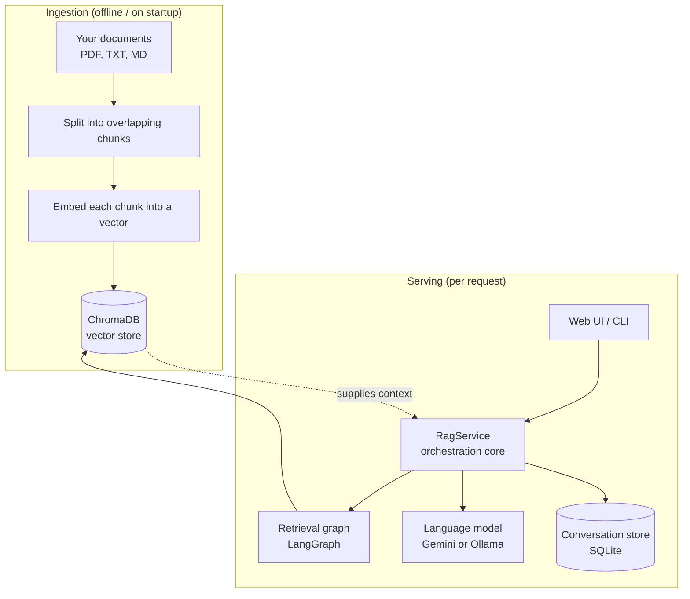
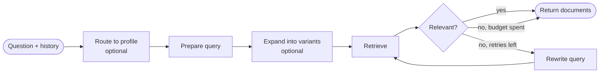
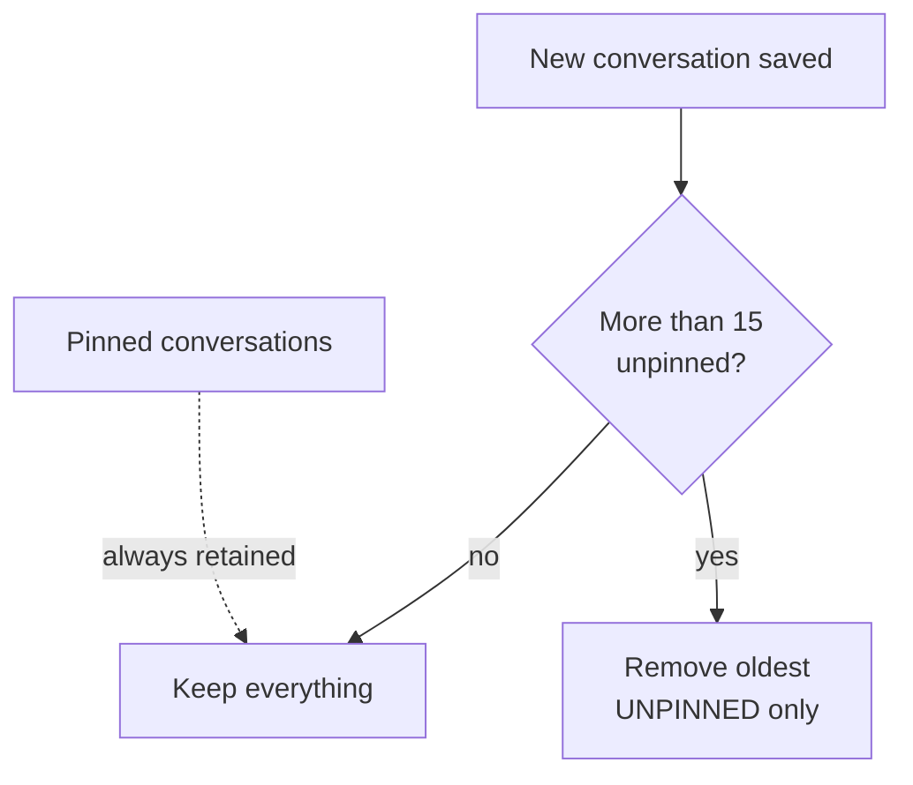
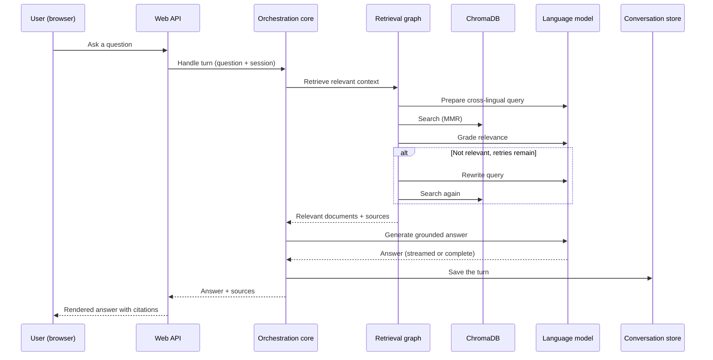

# Architecture Overview

This document explains **how the Futures Trading Assistant works** — the ideas
behind each part of the system, how the pieces fit together, and the reasoning
behind the important design decisions. It deliberately stays at the conceptual
level: it describes behavior and responsibilities rather than walking through
source code.

---

## 1. What the system is

The Futures Trading Assistant is a **Retrieval-Augmented Generation (RAG)**
application. It answers questions about futures trading by combining two things:

1. **A private knowledge base** built from your own documents (a trading
   glossary, PDFs, Markdown notes, etc.).
2. **A large language model (LLM)** that writes fluent, conversational answers.

Instead of relying on whatever the model happened to memorize during training,
every answer is *grounded* in passages retrieved from your documents. This makes
answers more accurate, keeps them on-topic, and lets the assistant cite the
sources it used.

The assistant is **bilingual** (English and Hungarian), can run against either a
**hosted model (Google Gemini)** or a **fully local model (Ollama)**, and
remembers past conversations so you can return to them later.

---

## 2. The big picture

At runtime the application is organized into a few cooperating layers. Data
flows from your documents into a searchable index, and questions flow from a user
interface through an orchestration core that retrieves knowledge and generates an
answer.

The two halves run at different times:

- **Ingestion** turns raw documents into a searchable vector index. It runs when
  the app starts and detects that your documents have changed.
- **Serving** answers questions using that index. It runs continuously while the
  assistant is in use.

---

## 3. Configuration: one source of truth

Every tunable value in the system — file locations, which model to use, chunk
sizes, retrieval parameters, language, rate limits — lives in a single, validated
**settings** object. Nothing else in the codebase hard-codes these values.

Settings can be overridden through environment variables (prefixed with `RAG_`)
or a local `.env` file. This means the same code can run in very different modes
— English or Hungarian, hosted or local model, aggressive or relaxed retrieval —
purely by changing configuration, without touching logic.

Because the configuration is strongly typed and validated, invalid values (a
negative chunk size, an out-of-range port, an unknown language) are caught
immediately at startup rather than causing confusing failures later.

---

## 4. Ingestion: turning documents into knowledge

Before the assistant can answer anything, your documents have to be transformed
into a form that supports fast semantic search.

### 4.1 Loading & Cloud Storage Support

The ingestion pipeline scans the data directory and loads every supported file:

- **PDFs** are read one page at a time, and each page becomes its own unit. The
  page number is remembered so answers can point back to the exact page.
- **Text and Markdown** files are loaded as whole documents.

Empty pages and empty files are skipped so they don't pollute the index.

The ingestion pipeline scans the configured document source:
- **Local Storage:** Loads supported files directly from the local `./data` directory.
- **AWS S3 Storage:** When `RAG_USE_S3_STORAGE=true`, document metadata and file streams are dynamically fetched from the configured S3 bucket via `boto3` without needing local file persistence.

### 4.2 Chunking

Whole documents are too large to retrieve usefully, so each one is split into
**overlapping chunks**. Overlap matters: a sentence that explains a concept might
straddle a chunk boundary, and the overlap ensures that context isn't lost at the
seams. Chunk size and overlap are both configurable.

### 4.3 Embedding

Each chunk is converted into an **embedding** — a numeric vector that captures the
chunk's meaning. Chunks about similar topics end up close together in vector
space, even when they use different words. This is what makes *semantic* search
possible: the system can match a question to relevant passages by meaning rather
than by keyword.

### 4.4 Persisting

The embedded chunks are stored in **ChromaDB**, a local vector database kept on
disk. Once built, it can be reopened instantly on future runs without
re-processing the documents.

### 4.5 Change detection

Re-indexing is expensive, so the system avoids doing it unnecessarily. It keeps a
small **manifest** — a fingerprint of the data directory based on file names,
sizes, and modification times.

On startup the app compares the current fingerprint against the stored one:

- **Unchanged** → the existing index is reused as-is.
- **Changed** → the old index is discarded and rebuilt from scratch.
- **Missing** → the index is built for the first time.

The result is a fast startup in the common case, with automatic rebuilds exactly
when your documents actually change.

> Note: When S3 storage is enabled, change detection queries object timestamps and sizes directly from S3 to determine if a vector DB rebuild is required.

---

## 5. Retrieval: finding the right passages

When a question arrives, the assistant needs to pull the most relevant chunks out
of ChromaDB. This is handled by a **retriever** configured for quality, not just
raw similarity.

### 5.1 Maximum Marginal Relevance (MMR)

A naive retriever returns the chunks most similar to the query — but those chunks
are often nearly identical to each other, wasting the limited context budget on
redundant information. The system instead uses **Maximum Marginal Relevance**,
which balances two competing goals:

- **Relevance** — how well a chunk matches the question.
- **Diversity** — how different a chunk is from the ones already chosen.

MMR first gathers a larger candidate pool, then selects a smaller final set that
is both on-topic *and* varied. The trade-off between relevance and diversity, the
size of the candidate pool, and the number of chunks returned are all
configurable.

---

## 6. The retrieval graph: cross-lingual search with self-correction

Simple retrieval — "embed the question, fetch similar chunks" — breaks down in
two common situations:

- The user's question is in one language but the documents are in another.
- The question is a vague follow-up ("and what about that one?") that only makes
  sense given the conversation so far.
- The first search simply misses, returning passages that don't actually answer
  the question.

To handle these robustly, retrieval is orchestrated as a small **state machine**
(built with LangGraph). It threads a piece of state through a sequence of steps,
with the ability to loop back and try again.

### 6.1 Prepare the query (cross-lingual)

The first step rewrites the raw user turn into a **standalone search query in the
corpus language**. This does two jobs at once:

- **Resolves references** using the conversation history, so "and its margin?"
  becomes a self-contained question.
- **Translates** the query into the language your documents are written in, so a
  Hungarian question can still match an English glossary (and vice-versa). The
  translation deliberately uses the **canonical terminology of the subject
  domain** rather than a literal word-for-word rendering, so the query matches
  how the documents are actually written.

### 6.2 Retrieve

The prepared query is run against the MMR retriever to fetch candidate chunks.

### 6.3 Grade

The retrieved chunks are **judged for relevance** by the model: can these
passages actually support an answer to the question? This is the heart of the
self-correction mechanism — the system checks its own work before committing to
an answer.

### 6.4 Rewrite and retry

If the chunks are judged inadequate, a **rewrite** step reformulates the search
query (rephrasing, broadening, or re-focusing it) and the graph loops back to
retrieve again. This continues until relevant chunks are found or a configurable
**retry budget** is exhausted. When the budget runs out, the system proceeds with
the best documents it has rather than failing — a "best effort" answer beats no
answer.

Self-correction can be turned off entirely in configuration, in which case the
graph degenerates into a single prepare-and-retrieve pass. This is useful when
minimizing model calls and latency matters more than maximum recall.

### 6.5 Multi-query fan-out and reranking (optional)

A single query can miss passages that use different phrasing than the user did.
When enabled, an extra **expand** step turns the prepared query into several
complementary variants (synonyms, alternative phrasings, different facets of the
same information need). Each variant is retrieved **in parallel**, and the
resulting ranked lists are fused with **Reciprocal Rank Fusion (RRF)** — a
robust, score-free reranker that rewards passages ranking highly across multiple
variants. The result is broader recall without sacrificing precision. When the
feature is off, retrieval runs the single prepared query exactly as before.

### 6.6 Profile / tenant routing (optional)

The same application can serve **several businesses or knowledge domains** from
one deployment. Each **profile** carries its own answer persona (system prompt),
and — when routing is enabled — a lightweight classification step picks the
best-matching profile for each question before retrieval. This is what lets a
single white-label install act as, say, a law firm's assistant and a healthcare
provider's assistant at once, each answering in its own voice. Profiles are
defined in configuration, so adding one never touches code.

### 6.7 Why generation is kept out of the graph

Notably, **writing the answer is not part of this graph**. Retrieval and
generation are deliberately separated. This gives three benefits:

1. **Sources first** — the UI can display the source documents as soon as
   retrieval finishes, before a single word of the answer has been generated.
2. **Streaming** — the answer can be streamed token-by-token to the user for a
   responsive feel, independent of the retrieval logic.
3. **Fewer model calls** — a single turn never triggers a second retrieval pass,
   which keeps latency down and eases pressure on provider rate limits.

---

## 7. Generation: writing the grounded answer

Once relevant chunks are in hand, the orchestration core assembles the final
prompt from three ingredients:

- The **retrieved context** (the chunks).
- The **conversation history** (so the answer stays coherent across turns).
- The **user's question**.

The model is instructed to answer *from the provided context* and to respond in
the configured interface language. The answer can be produced in two modes:

- **Complete** — the full answer is generated and returned at once.
- **Streamed** — tokens are yielded as they are produced, so the UI can render
  the answer as it arrives.

Either way, the answer is paired with the **sources** it drew from, and the
completed turn is saved into the conversation history.

### 7.1 Groundedness check (Self-RAG / CRAG)

Grounding the prompt in retrieved context reduces hallucination but does not
eliminate it — a model can still answer confidently from memory. As a safety net,
the assistant **verifies its own answer against the retrieved passages**:

- The model is instructed to **prepend a disclaimer** whenever it falls back to
  general knowledge. That disclaimer is a free, deterministic signal.
- When enabled, an extra check re-reads any answer that carries *no* disclaimer
  and asks whether it is actually supported by the context, catching silent
  hallucinations.

An answer judged ungrounded is **labelled** as coming from general knowledge and
has its (misleading) local-document citations **removed**, so users are never
shown sources that don't actually back the answer.

---

## 8. The language model abstraction

The assistant treats the language model as a **swappable component** behind a
common interface. Two backends are supported:

- **Google Gemini** — a hosted model. Fast and capable, but requires an API key
  and sends data to a third party.
- **Ollama** — a model running locally on your own machine. No API key, no data
  leaving your computer, at the cost of running the model yourself.

Choosing a provider is a configuration decision; the rest of the system doesn't
know or care which one is active. The app can also *probe* the configured model
at startup to fail fast with a helpful message — for example, if a local Ollama
server isn't running or the chosen model hasn't been downloaded.

### 8.1 Rate limiting

The retrieval graph can make several model calls per turn (query preparation,
grading, rewriting) on top of the final generation. To stay under provider quotas
(such as Gemini's free-tier requests-per-minute limit), an optional **shared
client-side rate limiter** can be attached to the model. Because a single limiter
instance is shared across every call, the whole pipeline draws from one common
budget rather than each step throttling independently. Setting the limit to zero
disables throttling entirely.

---

## 9. Conversation memory

The assistant remembers conversations at two levels.

### 9.1 In-memory history

While the app is running, each conversation's messages are held in memory and
fed back into the model on every turn. This is what lets the assistant handle
follow-up questions and pronouns naturally.

### 9.2 Persistent storage

Conversations are also saved to a local **SQLite database** so they survive
restarts. The store is designed with a few deliberate properties:

- **Thread-safe** — each operation uses its own short-lived database connection,
  which keeps it safe under a concurrent web server.
- **Titled automatically** — a conversation's title is derived from its first
  question, so the history list is readable without manual naming. Titles can
  also be renamed.
- **Cascading deletes** — deleting a conversation removes all of its messages
  together.
- **Permission-hardened** — the database file and its directory are locked down
  to the owner, since conversation content can be sensitive.

### 9.3 Retention and pinning

To keep storage bounded, the assistant retains only the **most recent 15
conversations** and automatically prunes older ones.

Users can **pin** conversations they want to keep. Pinning changes retention
behavior in two ways:

- **Pinned conversations are never pruned**, no matter how many newer
  conversations arrive.
- **Pinned conversations don't count toward the 15-conversation limit**, so
  pinning something never causes an unpinned conversation to be evicted early.

Pinned conversations are also surfaced at the top of the history list. Under the
hood, pin state is a simple flag on each conversation, and the app safely
upgrades older databases that predate the feature by adding the flag on startup.

### 9.4 Durable, resumable graph state

Beyond the conversation transcript, the **retrieval graph itself** can persist
its per-conversation working state through a **LangGraph SQLite checkpointer**.
Each conversation is keyed by a thread id, so a turn's graph state is durable
across restarts and could be resumed rather than recomputed. Checkpointing is a
configuration toggle (on by default); when disabled the graph keeps its state
purely in memory, which is how the unit tests run without touching disk.

---

## 10. The two user interfaces

The same orchestration core is shared by two front ends, so behavior is
consistent no matter how you interact with the assistant.

### 10.1 The startup wizard and CLI

Launching the app drops the user into a short guided setup that:

1. Chooses the interface language.
2. Chooses the model backend (hosted Gemini or local Ollama).
3. Collects and validates the Gemini API key when needed (local models skip
   this).
4. Chooses how to interact — browser web UI or the terminal.

The same wizard powers both entry points, giving a single, predictable way to
start the assistant. API keys entered here are stored securely in the operating
system's native credential store, not in plain-text files.

### 10.2 The web API and UI

The HTTP layer exposes the assistant over a small set of endpoints for chatting
(including a plain token stream **and** a structured progress stream), listing and
reading past conversations, and renaming, pinning, or deleting them. On startup it
prepares the vector index and builds the orchestration core once, then reuses it
for every request.

The structured progress stream is what powers the UI's **live pipeline
indicator**: as each retrieval stage completes (routing → preparing → expanding →
retrieving → grading → rewriting → answering), the server emits a small status
event, then streams the answer tokens, then a final event carrying the sources and
groundedness verdict. Users see *what the assistant is doing* instead of an opaque
spinner.

The web UI itself is a **single self-contained page** with no external
dependencies, so it works fully offline. It is bilingual, driven by an in-page
translation table, and includes an **in-house Markdown renderer**.

That renderer deserves a note: model answers come back as Markdown (bold,
headings, numbered and bulleted lists, inline code, links). Rendering that as raw
text would show literal `**` and `*` symbols instead of formatting. The UI
therefore converts the Markdown to formatted HTML for display. Crucially, this is
done **safely**: all content is escaped first and only a known, limited set of
formatting tags is emitted, so a malicious document or answer cannot inject
active content into the page.

### 10.3 First-run setup

The server is resilient at startup: if a required Gemini API key is missing, it
does not crash — it starts anyway and reports, through its configuration
endpoint, that setup is still needed. The web UI reads this on load and shows a
one-time panel to collect the key, which is then validated and stored in the OS
credential manager. This is what allows a freshly installed desktop build to
open its window and guide the user through setup, rather than showing a blank
error.

---

## 11. Packaging & distribution

The same application can be delivered two ways: as a source project run with
`uv`, or as a **native desktop installer** for non-technical users. The desktop
packaging is an independent layer that reuses the existing backend and web UI
unchanged.

- **Self-contained runtime.** The Python backend and all of its dependencies are
  frozen into a single executable, so a user's machine needs nothing
  preinstalled. This removes the "works on my machine" class of problems caused
  by differing Python versions and dependency sets.
- **Desktop shell.** A lightweight native shell launches that frozen backend as a
  background process, waits for it to become healthy, and then displays the same
  web UI in a desktop window. It uses the operating system's built-in web view,
  keeping installers small.
- **Open data, hidden code.** The application code lives inside the bundled
  executable and is not exposed, but the **source documents live in an ordinary,
  user-writable folder** under the user's account. Technical users expand the
  knowledge base exactly as before — adding or removing files — and the backend
  re-indexes automatically on the next launch. A menu action opens that folder
  directly.
- **Reproducible releases.** Installers for every platform are produced by a
  continuous-integration workflow triggered by a version tag, keeping releases
  consistent and hands-off.

A dedicated guide, [DESKTOP.md](DESKTOP.md), covers the packaging mechanics and
the release process in detail.

---

## 12. End-to-end request flow

Putting it all together, here is what happens for a single question in the web UI:

---

## 13. Design principles at a glance

A few themes recur throughout the system and explain many of the specific
choices above:

- **Grounding over guessing.** Every answer is tied to retrieved evidence, and
  the assistant checks that evidence before answering.
- **One source of truth for configuration.** Behavior is steered by validated
  settings, not scattered constants.
- **Separation of concerns.** Retrieval, generation, storage, model access, and
  the user interfaces are independent layers that meet at small, well-defined
  boundaries — which is also what makes the system easy to test.
- **Swappable infrastructure.** The model provider and interface language are
  configuration choices, not architectural commitments.
- **Do the expensive work only when needed.** Indexing is skipped unless the
  documents change; retrieval runs once per turn.
- **Safe by default.** Credentials live in the OS keychain, the conversation
  database is permission-locked, and rendered content is escaped.
