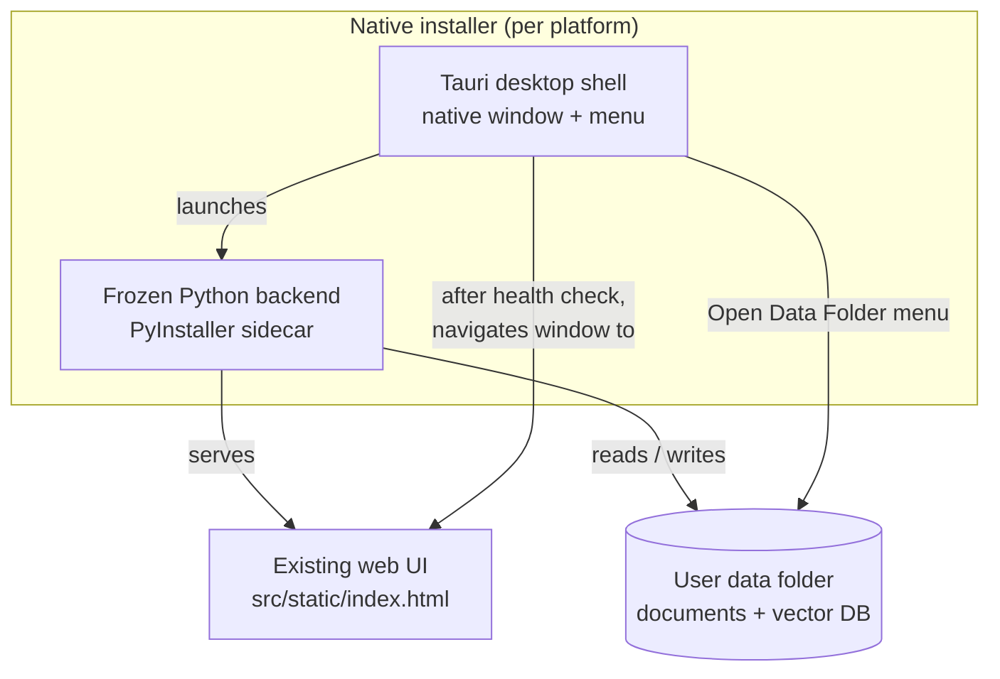

# Desktop App & Releases

This document explains how the Futures Trading Assistant is packaged into
**native, cross-platform desktop installers** and how those installers are
produced automatically as GitHub Releases. It focuses on *how the packaging
works and why it is built this way*, not on individual lines of code.

Everything related to packaging lives in the [`desktop/`](../desktop) folder,
separate from the application source in [`src/`](../src).

---

## 1. The problem being solved

The assistant is a Python application that depends on heavy libraries
(ChromaDB, LangChain, FastEmbed/ONNX, and so on). Asking an end user to
install Python, create a virtual environment, and resolve those dependencies is
fragile — it breaks across operating systems and Python versions. This is the
**"different environments" problem**.

The desktop packaging removes that problem entirely:

- The Python interpreter **and every dependency** are frozen into a single
  self-contained executable. The user's machine needs nothing preinstalled.
- That executable is wrapped in a small native desktop window and shipped as a
  standard installer (`.msi`/`.exe` on Windows, `.dmg`/`.app` on macOS,
  `.AppImage`/`.deb` on Linux).
- The application **code is bundled and effectively hidden** inside the
  executable, while the user's **documents stay in an open, editable folder**.

---

## 2. Why Tauri (not Electron)

Both Tauri and Electron can wrap a web UI in a desktop window. Tauri was chosen
because:

- **Smaller installers.** Tauri uses the operating system's built-in web view
  instead of bundling a full copy of Chromium, so installers are a fraction of
  the size of an equivalent Electron app.
- **First-class "sidecar" support.** Tauri is designed to bundle and launch an
  external executable alongside the app. That is exactly our model: the desktop
  shell launches the frozen Python backend as a sidecar.
- **Official multi-platform release tooling.** The `tauri-action` GitHub Action
  builds installers for every platform and attaches them to a release with
  minimal configuration.

---

## 3. How the pieces fit together



At runtime:

1. The user launches the installed app. The Tauri shell opens a window showing a
   **splash screen** and starts the bundled backend as a sidecar process.
2. The backend resolves a **user-writable data directory**, seeds it with the
   default documents on first launch, builds/loads the vector index, and starts
   the same FastAPI server used by the source install.
3. The shell waits until the backend answers, then **navigates the window** to
   the local server — the familiar chat web UI.
4. If a Gemini API key is required and not yet stored, the web UI shows a
   **first-run setup panel** to collect it (see §6).

---

## 4. The frozen backend (sidecar)

The sidecar is produced from [`desktop/backend/entry.py`](../desktop/backend/entry.py)
by PyInstaller, using [`desktop/backend/backend.spec`](../desktop/backend/backend.spec).

The entry point is deliberately thin. It:

- Computes the per-user data and database directories.
- Seeds the default documents into the data directory **only if it is empty**,
  so a user's own files are never overwritten on upgrade.
- Points the existing settings layer at those directories using `RAG_*`
  environment variables (the same variables documented in the main README).
- Starts the unchanged FastAPI application.

Because the spec file uses PyInstaller's `collect_all` on the packages the
sidecar needs (and explicitly **excludes** PyTorch / transformers), hidden
imports and data files are pulled in without shipping a multi-hundred megabyte
ML stack. Embedding **weights** and the Chroma database are created under the
user data directory on first run — not baked into the installer.

---

## 5. The user data directory

Keeping the "add or remove files in a folder" workflow after installation is a
core requirement. The backend therefore reads documents from a **normal,
user-owned folder**, not from inside the bundled (hidden) code:

| Platform | Location |
| --- | --- |
| Windows | `%APPDATA%\FuturesTradingAssistant\data` |
| macOS | `~/Library/Application Support/FuturesTradingAssistant/data` |
| Linux | `$XDG_DATA_HOME/FuturesTradingAssistant/data` (or `~/.local/share/...`) |

The vector database lives beside it in a `chroma_db` folder under the same root.

**Expanding the knowledge base** works just like the source install: drop
`.pdf`, `.txt`, or `.md` files into the `data` folder (or delete some), then
restart the app. The backend fingerprints the folder and automatically
re-indexes when it detects a change.

To make the folder easy to find, the desktop shell adds a **File → Open Data
Folder** menu item that opens it in the system file manager.

---

## 6. First-run setup (API key)

A freshly installed app has no stored Gemini API key. Rather than failing to
start, the backend now **starts anyway** and reports that setup is needed. The
web UI detects this on load and shows a small panel to paste the key. The key is
validated, then stored securely in the operating system's credential manager
(never in a plain-text file), and the assistant becomes ready without a restart.

Users who prefer a **fully local** setup can instead run the local Ollama
provider, which needs no key (configured via the `RAG_LLM_PROVIDER=ollama`
environment variable). In that case the setup panel does not appear.

---

## 7. Building locally

Prerequisites: [Rust](https://www.rust-lang.org/tools/install),
[Node.js](https://nodejs.org/), the Tauri system dependencies for your platform
(see the [Tauri prerequisites guide](https://tauri.app/start/prerequisites/)),
and this project's Python environment via `uv`.

```bash
# 1. Install Python deps (includes PyInstaller)
uv sync --dev

# 2. Install the Tauri CLI
cd desktop
npm install

# 3. Generate the application icons once (from the committed source image)
npm run tauri icon app-icon.png

# 4. Build the backend sidecar, then the installer
npm run tauri build
```

Step 4 triggers `beforeBuildCommand`, which runs
[`desktop/scripts/build_backend.py`](../desktop/scripts/build_backend.py) to
freeze the backend and copy it into `src-tauri/binaries` with the target-triple
name Tauri expects. The finished installer is written under
`desktop/src-tauri/target/release/bundle/`.

For rapid UI iteration you can still run the plain web server
(`uv run uvicorn src.api:app`) — the desktop shell serves the exact same UI.

---

## 8. Automated releases

The workflow [`.github/workflows/release.yml`](../.github/workflows/release.yml)
builds installers for **Windows, macOS (Apple Silicon + Intel), and Linux** in
parallel and attaches them to a GitHub Release.

Trigger it by pushing a version tag:

```bash
git tag v0.1.0
git push origin v0.1.0
```

Each matrix job installs Rust, Node, and the Python environment, freezes the
backend, generates icons, and runs `tauri-action` to build and upload the
platform installer. The release is created as a **draft** so you can review the
assets and write release notes before publishing.

> **Code signing / notarization.** The workflow produces unsigned installers.
> For production distribution (especially macOS notarization and Windows
> SmartScreen), add the relevant signing certificates as repository secrets and
> the corresponding `tauri-action` / environment settings. This is intentionally
> left out of the default workflow.

---

## 9. What is and isn't committed

Build outputs are generated, not stored in Git (see
[`desktop/.gitignore`](../desktop/.gitignore)):

- **Committed:** all scaffolding — Tauri config, Rust shell, the PyInstaller
  spec and build script, the splash frontend, and the source icon
  `desktop/app-icon.png`.
- **Not committed:** the frozen sidecar binaries, the generated icon set, and
  the Rust/PyInstaller build directories.
